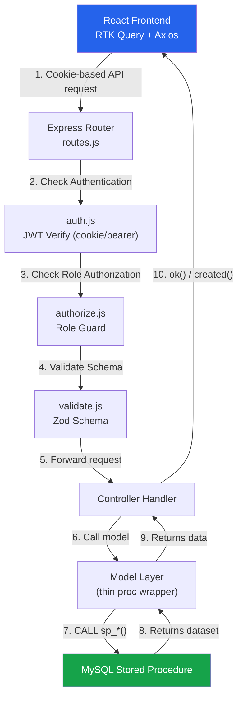
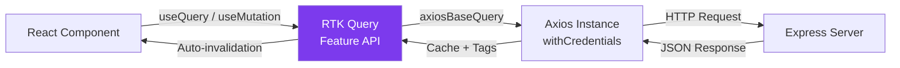

# CampusCore — Project Analysis & Codebase Flow Report

This report provides a comprehensive analysis of the **CampusCore School Management System** project from a **Code Reviewer** and **Project Manager** perspective — covering architecture, data flow, code quality, implementation status, security posture, and actionable recommendations.

> **Last Updated:** 2026-06-15 · **Analyzed by:** Automated Code Review

---

## 🏗️ 1. Technical Architecture & Tech Stack

The application is structured as a monorepo consisting of:
*   **Backend (`/server`)**: A RESTful API driven by Node.js, Express, and MySQL.
*   **Frontend (`/client`)**: A single-page application built with React 19, Vite, Tailwind CSS v4, and shadcn/ui.
*   **Database**: MySQL 8 with 8 tables and 37 stored procedures — all data access is procedure-driven.

### Frontend Technology Stack
*   **Routing**: React Router v7 (configured in [App.jsx](file:///d:/School%20Management/client/src/App.jsx) with lazy-loaded layouts and guards).
*   **State Management & Data Fetching**: **Redux Toolkit + RTK Query** (with a custom Axios-based base query in [baseApi.js](file:///d:/School%20Management/client/src/app/baseApi.js) that enables credentials for cookie-based JWT transmission).
*   **Styling**: Tailwind CSS v4 + **shadcn/ui** components for modular, polished interfaces.
*   **Forms**: `react-hook-form` + `zod` for frontend schema validation.
*   **Toasts & Loading Feedbacks**: `sonner` for notification popups and `Skeleton` from shadcn/ui for screen skeleton loaders.
*   **Charts**: `recharts` for dashboard analytics visualization.
*   **Compiler**: React 19 Compiler enabled via Vite babel preset.

### Backend Technology Stack
*   **Express & Routing**: Handles incoming request verification, controller binding, and modular mounting across 6 route files.
*   **Stored-Procedure Database Layer**: The Node server does not execute inline SQL. Instead, all database modifications and reads go through pre-defined MySQL stored procedures (defined in [procedures.sql](file:///d:/School%20Management/server/database/procedures.sql)).
*   **Authentication**: Cookie-based HttpOnly JWT cookies with fallback to Bearer header. Guards verify the token and store user details in `req.user`.
*   **Validation**: Zod schemas run as middleware to validate input properties before hitting controller handlers.
*   **Email**: Nodemailer SMTP transporter with HTML templates for password reset and welcome emails.
*   **File Uploads**: Multer memory storage → Cloudinary stream upload for avatar images.
*   **API Documentation**: Swagger/OpenAPI via JSDoc annotations in `src/docs/`.

---

## 🔒 2. User Roles & Multi-Tenancy Scoping

The database consolidates all login-capable individuals under a single unified table: `staff` ([schema.sql](file:///d:/School%20Management/server/database/schema.sql)).

| Role Name | Table Context | `school_id` | `department_id` | Scope and Permissions |
| :--- | :--- | :--- | :--- | :--- |
| **Super Admin** | `staff` | `NULL` | `NULL` | Global scope. Creates/manages schools and school admins. Platform-wide dashboard. |
| **School Admin** | `staff` | Defined | `NULL` | Tenant-scoped. Creates departments, registers staff, assigns tasks, manages schedules & leaves for their school only. |
| **Staff** | `staff` | Defined | Defined | Department-scoped. Clock in/out, view schedule, submit leave requests, update assigned tasks, manage own profile. |

### Security Boundaries (Tenancy Guard)
The API protects tenant boundaries by extracting the authenticated user's `school_id` from the JWT inside the authorization middleware:
1.  **Never trust `school_id` from request bodies** for School Admin / Staff routes.
2.  Use the `school_id` attached to `req.user.school_id` inside controller operations.
3.  Cross-tenant ID requests (e.g., trying to view a staff member from another school) are caught in stored procedures (via `SIGNAL SQLSTATE '45000'`) or controller checks and return `404 Not Found`.
4.  **School status enforcement**: Inactive schools block login for all their users at the authentication level.

---

## 🔄 3. Complete Data Flow Diagram

### Frontend Data Flow (RTK Query)

---

## 📊 4. Implementation Status & Code Inventory

### Code Metrics

| Category | Count | Details |
|----------|-------|---------|
| Database Tables | 8 | `roles`, `schools`, `departments`, `staff`, `staff_schedules`, `staff_attendance`, `leave_requests`, `staff_tasks` |
| Stored Procedures | 37 | All `sp_*` prefixed, with tenancy validation |
| Server Controllers | 5 | auth, school, schoolAdminManager, department, staff |
| Server Models | 5 | auth, school, department, staff, staffActivity |
| Server Routes | 6 | auth, school, schoolAdminManager, schoolAdmin, department, staff |
| Server Schemas | 4 | auth, school, department, staff (with 12+ schema exports) |
| API Endpoints | 40+ | Across all route groups |
| Client Feature Modules | 6 | auth, guest, profile, super_admin, school_admin, staff |
| Client Pages | 15+ | Across all role panels |
| Client Shared Components | 6 | StatCard, StatusBadge, EmptyTableState, AppBreadcrumb, AppPagination, PagePlaceholder |
| Custom Hooks | 4 | useAuth, useLogout, useDataTable, use-mobile |
| RTK Query Tag Types | 8 | User, School, Department, Staff, SchoolAdmin, StaffSchedule, StaffAttendance, StaffLeave |
| Email Templates | 2 | welcomeEmailTemplate, resetPasswordTemplate |
| Swagger Doc Files | 4 | auth, school, department, staff |

### Phase Completion Status

| Phase | Name | Status | Notes |
|-------|------|--------|-------|
| 0–2 | Setup, DB, Connection | ✅ Complete | 8 tables, 37 procs, pool verified |
| 3 | Authentication | ✅ Complete | JWT cookie + Bearer, forgot/reset password |
| 4 | Super Admin Module | ✅ Complete | Schools + School Admin CRUD |
| 5 | School Admin Module | ✅ Complete | Departments + Staff CRUD |
| 6 | Staff & Profile | ✅ Complete | Profile, avatar, password, edit |
| 7.0–7.1 | State & Auth Shell | ✅ Complete | RTK store, baseApi, layouts, guards |
| 7.2 | Super Admin: Schools UI | ✅ Complete | Table, create dialog, status toggle |
| 7.3 | Super Admin: Admins UI | ✅ Complete | List, create, delete, status toggle |
| 7.4 | School Admin: Departments | ✅ Complete | List + create dialog |
| 7.5 | School Admin: Staff | ✅ Complete | Register (single/batch), list, status |
| 7.6 | Profile & Password | ✅ Complete | Avatar upload, edit dialog, change password |
| 7.7 | Cross-cutting Polish | ✅ Complete | Error handling, skeletons, responsiveness |
| 8 | Polish | ✅ Mostly | Email, pagination, search, charts, CSV export |
| 9.1–9.2 | Staff Portal Backend | ✅ Complete | Schema + procs + models + routes |
| 9.3–9.6 | Staff Portal Frontend | ✅ Complete | Dashboard, schedule, attendance, leaves |
| 9.7 | School Admin Management | ✅ Complete | Schedules + leaves management pages |
| 9.8 | Documents/Payslips | 🔴 Pending | Not started |

---

## 🔍 5. Code Quality Assessment

### ✅ Strengths

| Area | Assessment |
|------|------------|
| **Architecture** | Clean separation: routes → validate → controller → model → stored procedure. Consistent across all features. |
| **Tenancy Isolation** | Robust — `school_id` from JWT token only, never from request body. Stored procedures double-check tenancy with `SIGNAL SQLSTATE '45000'`. |
| **Authentication** | httpOnly cookie prevents XSS token theft. Bearer fallback for non-browser clients. School status check blocks inactive school logins. |
| **Validation** | Every input-accepting endpoint has a Zod schema. Both client and server validate independently. |
| **State Management** | RTK Query with tag-driven cache invalidation is production-grade. Custom axios baseQuery with `withCredentials` is clean. |
| **Code Organization** | Feature-folder pattern on frontend. Centralized icon library. Shared components prevent duplication. |
| **Email Integration** | Fire-and-forget pattern for welcome emails prevents blocking responses. Template-based HTML emails are well-structured. |
| **Database Design** | Proper FK constraints, indexes for common lookups, idempotent scripts, circular FK handling. |

### ⚠️ Areas for Improvement

| Area | Issue | Recommendation |
|------|-------|----------------|
| **Test Coverage** | Zero automated tests | Add Vitest/Jest for backend models and API routes. Critical for regression prevention. |
| **Service Layer** | Controllers call models directly (services/ empty) | Acceptable for current size, but consider extracting business logic if controllers grow beyond ~100 lines. |
| **Console Logs** | `console.log` statements in production code ([staff.controller.js L79, L345, L353](file:///d:/School%20Management/server/src/controllers/staff.controller.js#L79)) | Replace with a structured logger (e.g., `pino` or `winston`) with log levels. |
| **Error Handling** | Stored procedure `SIGNAL` errors not cleanly mapped to HTTP status codes | Add a middleware to parse `SQLSTATE '45000'` errors and map them to appropriate 4xx responses. |
| **CORS Origin** | `origin: true` allows all origins | Restrict to `CLIENT_URL` in production. |
| **Pagination** | All list queries return full datasets | Implement server-side pagination with `LIMIT/OFFSET` for scalability. |
| **Soft Delete** | Hard deletes in `sp_delete_school_admin`, `sp_delete_staff_schedule`, `sp_delete_staff_task` | Add `deleted_at` column for soft deletes; keep hard delete as an admin-only option. |
| **Swagger Coverage** | Only 4 swagger doc files; staff portal & school-admin endpoints undocumented | Extend swagger annotations to cover all 40+ endpoints. |

---

## 🔐 6. Security Assessment

| Check | Status | Notes |
|-------|--------|-------|
| JWT in httpOnly cookie | ✅ | Prevents XSS token theft |
| Password hashing (bcrypt) | ✅ | Proper salt rounds |
| Zod input validation | ✅ | All endpoints validated |
| Tenant scoping (JWT-derived) | ✅ | Never trusts request body for school_id |
| School status enforcement | ✅ | Inactive schools block all user access |
| ER_DUP_ENTRY → 409 | ✅ | Duplicate email handled gracefully |
| Stored procedure tenancy checks | ✅ | `SIGNAL SQLSTATE '45000'` for cross-school access |
| Rate limiting | ✅ | Tiered rate limiters: global (100 req/15min), auth endpoints (5 req/15min), and avatar upload (5 req/15min) |
| Helmet headers | ✅ | Implemented helmet middleware with custom CSP/COEP policies |
| CSRF protection | ❌ | Not needed for httpOnly cookie + same-site, but worth verifying SameSite attribute |
| Input sanitization | ✅ | Custom middleware recursively strips HTML tags/script strings from body, query, and params (Express 5 compatible) |
| File upload validation | ✅ | Enhanced multer upload middleware verifies magic bytes, extensions, and limits (2MB) |

---

## 💡 7. Development Strategy for Upcoming Implementations

When instructed to begin, each new feature should follow this workflow:

### Backend
1. **Write stored procedure** in `server/database/procedures.sql`. Re-run in Workbench.
2. **Add model wrapper** in the appropriate `models/*.model.js` using `callProcedure`/`callProcedureOne`.
3. **Add Zod schema** in `server/src/schema/*.schema.js`.
4. **Add controller** function in the appropriate controller.
5. **Add route** with `protect`, `authorize()`, and `validate()` middleware.
6. **Update Swagger docs** in `server/src/docs/`.

### Frontend
1. **Scaffold API endpoints**: Create/extend the RTK Query file (e.g., `feature.api.js`) with `providesTags` / `invalidatesTags`.
2. **Define validation schema**: Set up Zod schema in `client/src/schemas/`.
3. **Build modular components**: Construct UI in the feature's `components/` folder using shadcn/ui blocks.
4. **Connect to page layout**: Mount in the feature's `pages/` directory, link into [App.jsx](file:///d:/School%20Management/client/src/App.jsx).
5. **Update icons**: Add any new icons to the centralized `lib/icons/` library.
6. **Verify Flow**: Run lint check, verify tag invalidation, and ensure responsive styling in both themes.

---

## 📈 8. Project Health Summary

| Metric | Score | Details |
|--------|-------|---------|
| **Architecture Quality** | 🟢 9/10 | Clean layers, stored-procedure discipline, proper separation of concerns |
| **Code Consistency** | 🟢 8/10 | Consistent patterns across features; ESLint + Prettier enforced |
| **Security Posture** | 🟢 9/10 | Strong auth & tenancy; rate limiting, helmet headers, input sanitization, and upload validation fully implemented |
| **Test Coverage** | 🔴 1/10 | No automated tests — highest risk area |
| **Documentation** | 🟢 8/10 | Comprehensive PROJECT_PLAN, README files, and Swagger (partial) |
| **Scalability Readiness** | 🟡 6/10 | No server-side pagination, no caching layer, no connection pooling config |
| **UI/UX Quality** | 🟢 8/10 | shadcn/ui provides polish; consistent shared components; responsive layouts |
| **Feature Completeness** | 🟡 7/10 | Core flows complete; tasks page, documents, audit trail still pending |

**Overall Grade: A- (Hardened Foundation, Ready for Scale)**

The project demonstrates excellent architectural discipline (stored-procedure-only data access, multi-tenant scoping, tag-driven cache) and clean code organization. The primary gaps are in automated testing and server-side scalability features (pagination, caching). These are addressable incrementally without architectural changes.
