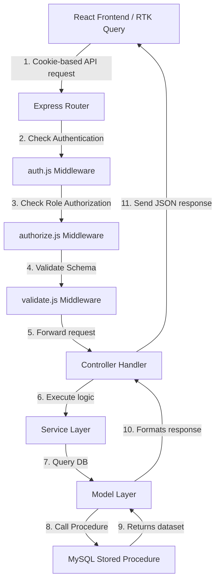

# CampusCore — Project Analysis & Codebase Flow Report

This report provides a detailed breakdown of the **CampusCore School Management System** project structure, core architectural decisions, data flow, and current implementation status.

---

## 🏗️ 1. Technical Architecture & Tech Stack

The application is structured as a monorepo consisting of:
*   **Backend (`/server`)**: A RESTful API driven by Node.js, Express, and MySQL.
*   **Frontend (`/client`)**: A single-page application built with React 19, Vite, Tailwind CSS, and shadcn/ui.

### Frontend Technology Stack
*   **Routing**: React Router v7 (configured in [App.jsx](file:///d:/School%20Management/client/src/App.jsx) with lazy-loaded layouts and guards).
*   **State Management & Data Fetching**: **Redux Toolkit + RTK Query** (with a custom Axios-based base query in [baseApi.js](file:///d:/School%20Management/client/src/app/baseApi.js) that enables credentials for cookie-based JWT transmission).
*   **Styling**: Tailwind CSS + **shadcn/ui** components for modular, polished interfaces.
*   **Forms**: `react-hook-form` + `zod` for frontend schema validation.
*   **Toasts & Loading Feedbacks**: `sonner` for notification popups and `Skeleton` from shadcn/ui for screen skeleton loaders.

### Backend Technology Stack
*   **Express & Routing**: Handles incoming request verification, controller binding, and modular mounting.
*   **Stored-Procedure Database Layer**: The Node server does not execute inline SQL. Instead, all database modifications and reads go through pre-defined MySQL stored procedures (defined in [procedures.sql](file:///d:/School%20Management/server/database/procedures.sql)).
*   **Authentication**: Cookie-based HttpOnly JWT cookies. High-security guards verify the token and store user details in `req.user`.
*   **Validation**: Zod schemas run as middleware to validate input properties before hitting controller handlers.

---

## 🔒 2. User Roles & Multi-Tenancy Scoping

The database consolidates all login-capable individuals under a single unified table: `staff` ([schema.sql](file:///d:/School%20Management/server/database/schema.sql)).

| Role Name | Table Context | `school_id` | `department_id` | Scope and Permissions |
| :--- | :--- | :--- | :--- | :--- |
| **Super Admin** | `staff` | `NULL` | `NULL` | Global scope. Can register/manage schools and assign school admins. |
| **School Admin** | `staff` | Defined | `NULL` | Tenant-scoped. Can manage departments and register staff for their school only. |
| **Staff** | `staff` | Defined | Defined | Department-scoped. Can only log in and view/manage their own profile details. |

### Security Boundaries (Tenancy Guard)
The API protects tenant boundaries by extracting the authenticated user's `school_id` from the JWT inside the authorization middleware:
1.  **Never trust `school_id` from request bodies** for School Admin / Staff routes.
2.  Use the `school_id` attached to `req.user.school_id` inside controller operations.
3.  Cross-tenant ID requests (e.g., trying to view a staff member from another school) are caught in stored procedures or controller checks and return `404 Not Found`.

---

## 🔄 3. Complete Data Flow Diagram

---

## 📊 4. Implementation Status & Next Phases

Below is the state of progress across all phases outlined in [PROJECT_PLAN.md](file:///d:/School%20Management/PROJECT_PLAN.md):

### 🟢 Completed Phases
*   **Phase 0 - 2 (Setup, DB, & Connection Models)**: DB tables seeded, connection pool configured, and global stored-procedure query execution utility finalized.
*   **Phase 3 - 5 (Backend Features)**: Auth, Schools management, School Admins creation, Departments, and Staff registration backend endpoints completed and validated.
*   **Phase 6 (Staff Profile & Avatar upload)**: Live profile fetching and Cloudinary-buffered avatar image uploads are fully functional.
*   **Phase 7.0 - 7.1 (State & Auth shell)**: Redux store initialized, custom base-query configured, layouts built with responsive navigation sidebars, session bootstrapped on page reload, and login/logout route redirection completed.
*   **Phase 7.2 (Super Admin: Schools)**: Listing schools, status toggles, and "Add School" modal form.
*   **Phase 7.3 (Super Admin: School Admins)**: Form to assign a school admin to an active school, generating temporary credentials.
*   **Phase 7.4 (School Admin: Departments)**: Interface to list and add department names.
*   **Phase 7.5 (School Admin: Staff)**: Register Staff registration form, staff members list table, and toggling staff status.
*   **Phase 7.6 (Profile & Password UI)**: Avatar upload, profile identity layout, and Change Password form.
*   **Forgot & Reset Password Flow**: SMTP email configuration with `nodemailer`, HTML reset templates, validation schemas, recovery token controllers, and client-side forgot/reset pages.

### 🟡 In-Progress (Current State)
*   **Phase 7.7 (Cross-cutting Polish)**: RTK Query global error handling, loading skeleton loaders, and UI polish.

### 🔴 Pending Implementations (To-Be-Built UI Pages)
*   **Phase 8 (Advanced Additions)**: Pagination/Search filters, credential emails, and Recharts statistics.

---

## 💡 5. Development Strategy for Upcoming Implementations

When instructed to begin, each frontend module will follow the strict instructions updated in the project memory:
1.  **Scaffold API endpoints first**: Create the feature RTK Query file (e.g. `schools.api.js`) to hook into `baseApi.js` and specify `providesTags` / `invalidatesTags`.
2.  **Define validation schema**: Set up form schemas using Zod.
3.  **Build modular components**: Construct UI components inside the respective feature's `components/` folder, utilizing standard shadcn UI blocks.
4.  **Connect to page layout**: Mount forms and tables in the feature's `pages/` directory, linking them into [App.jsx](file:///d:/School%20Management/client/src/App.jsx).
5.  **Verify Flow**: Run lint check, verify automated invalidation lists, and ensure high-fidelity styling.
